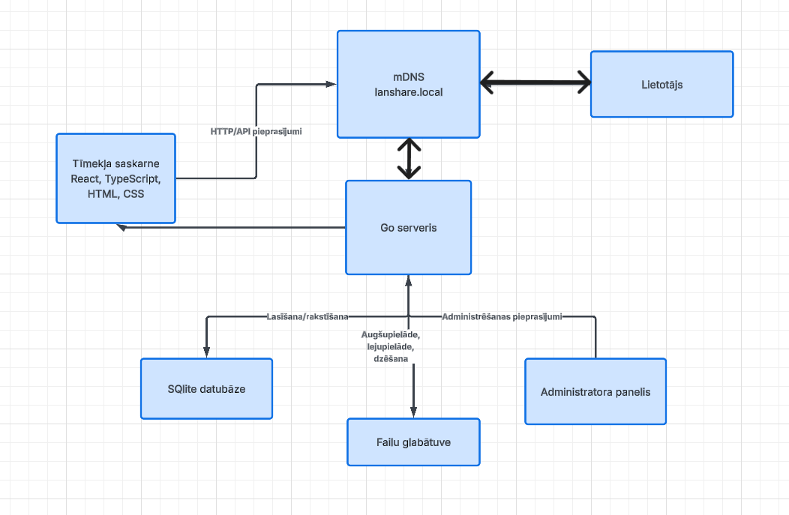
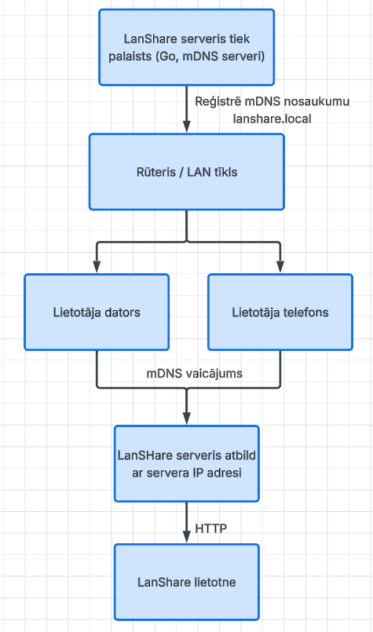
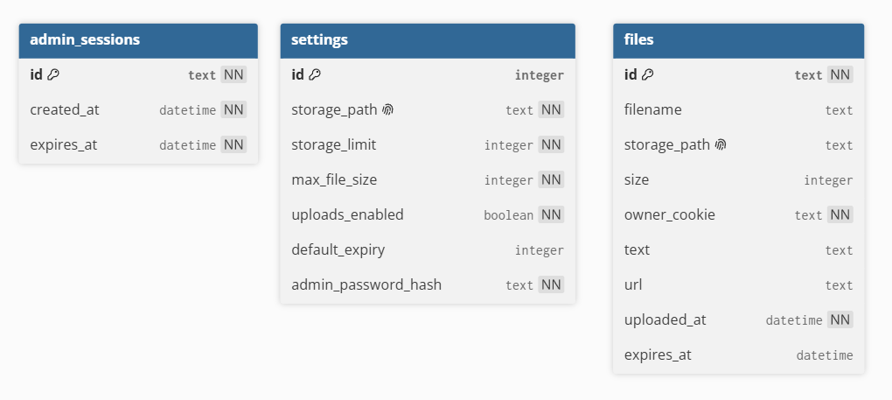
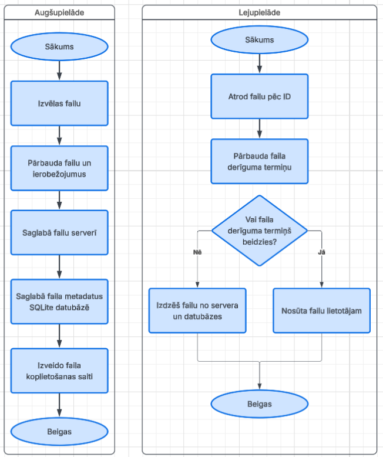
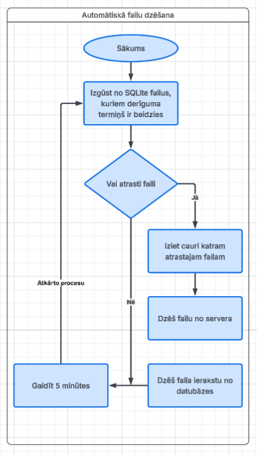
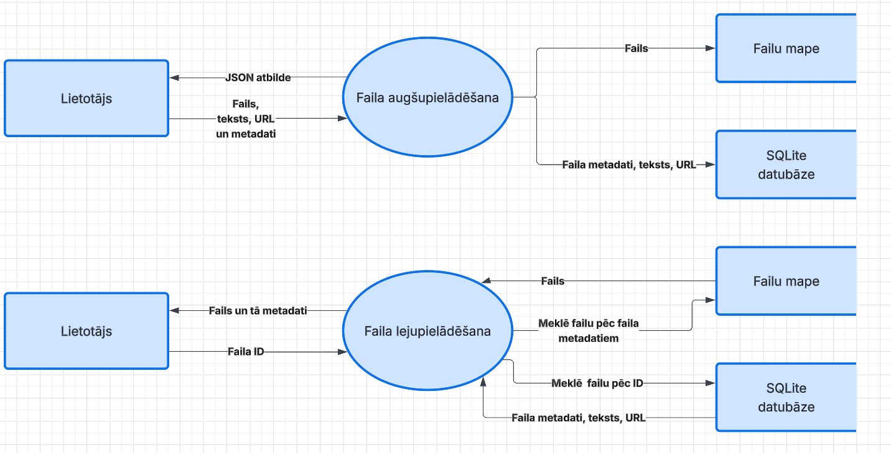
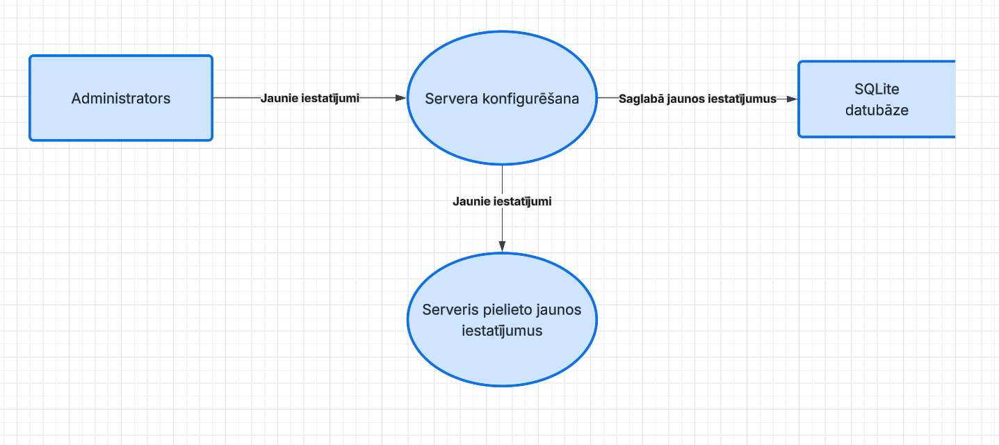
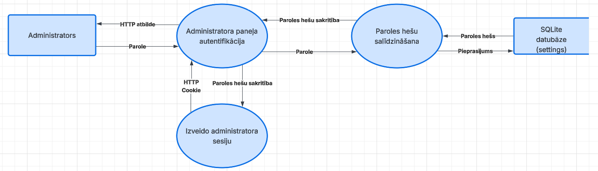

# TODO:

* Ievads garāks.

* Konkrētība vai ir ātri, vai ir precīzs skaitlis. Precizitāte
  * ātri
    ātrāks
    vienkārši
    daudz
    pietiekami
    mūsdienīgs
    būtiski
    liels

* Diagrammu apraksts

# LanShare

Cilvēkiem mūsdienās ir vairākas ierīces: telefoni, datori utt. Un rodas nepieciešamība pārsūtīt tekstu, linkus un failus starp šīm ierīcēm. Ir daudzi veidi, kā to darīt, izmantojot vadu, mākoņpakalpojumus, ziņapmaiņas lietotnes, kā WhatsApp, Discord utt., vai USB zibatmiņas.

Tomēr šīm metodēm ir savi trūkumi. Vada savienojamībai ir problēma, piemēram, pārvietojot failus no telefona, lietotājam ir jāmeklē fails, jāpārvieto tas, un tas process ir ļoti ilgs un ne vienmēr ir veiksmīgs. Lai nebūtu jāiet meklēt vads, bet visu varētu darīt pie datora, cilvēki izmanto Google disku, WhatsApp, Discord. Tie strādā, tomēr tie ne vienmēr ir ātri, jo tiek izmantots internets, un drošība ir apdraudēta, jo faili tiek sūtīti pa internetu un cilvēki, kuriem nav jāredz šie faili, var nokļūt pie tiem. Bieži vien šādiem pakalpojumiem ir ierobežojumi, kas neļauj pārsūtīt ļoti lielus failus. Lai izmantotu šādus pakalpojumus, ir nepieciešams instalēt papildu programmas.

Tā kā noskaidrojām ka failu pārsūtīšana caur internetu nav vienmēr ātra, izmantojot vadu, tā ne vienmēr ir ērta. Tad ir vajadzīgs kompromiss un labāks risinājums. Tāpēc, lai saglabātu failu pārsūtīšanas ātrumu, ērtumu un drošību, var izmantot lokālo tīklu, jo faili netiek sūtīti ārpus šī tīkla un var būt lielāks pārsūtīšanas ātrums, jo faili uzreiz ceļo no ierīces uz ierīci vienā tīklā, nevis izmantojot kādus citus pakalpojumus.

Tāpēc ir nepieciešamība pēc viena konkrēta produkta. Tas ir **LanShare**. LanShare nodrošina failu, tekstu un saišu pārsūtīšanu starp ierīcēm un citiem cilvēkiem, kas ir pieslēgušies tam pašam tīklam. LanShare ir domāts kā palīdzības rīks skolēniem, skolotājiem, darbiniekiem, vadītājiem un citiem cilvēkiem, kuri regulāri izmanto vairākas ierīces un kuriem ir nepieciešams pārsūtīt informāciju uz citām ierīcēm.


Lai produktu īstenotu ir nepieciešamas šādas tehnoloģijas:
* Go
* React
* TypeScript
* HTML
* CSS
* SQLite

LanShare sastāv no šādām sastāvdaļām:

* Go serveris ar iebūvētu mDNS servisu;
* React tīmekļa lietotne;
* SQLite datubāze;
* failu glabāšanas mape serverī.


Lai produkts darbotos, nepieciešams:

* lokālais tīkls;
* ierīce ar Windows vai Linux operētājsistēmu;
* vismaz 2 GB RAM;
* vismaz 1 GB brīvas vietas programmas un datubāzes darbībai;
* brīva diska vieta failu glabāšanai atbilstoši administratora konfigurētajam glabāšanas ierobežojumam;
* moderns tīmekļa pārlūks, piemēram, Google Chrome, Firefox vai Safari.


SQLite datubāzei nav nepieciešams atsevišķs datubāzes serveris. 
Failu glabāšanai nepieciešamā diska vieta ir atkarīga no administratora konfigurētā glabāšanas ierobežojuma.


Kad tiek ieslēgts LanShare serveris, tiek izveidots mDNS serviss un administratoram jāievada sākotnējā konfigurācija, ja tā tiek prasīta, lai lietotājiem nebūtu manuāli jāievada servera IP adrese. Tā vietā viņi var pieslēgties LanShare lietotnei, tīmekļa pārlūkā ievadot adresi `http://lanshare.local`.


---

# Prasību specifikācija

## Sistēmas funkcionālās prasības

### Sistēmas lomas

LanShare sistēmā ir divas lomas:

* **Lietotājs** - var augšupielādēt, lejupielādēt, koplietot un dzēst savus failus, tekstus un saites.
* **Administrators** - papildus lietotāja funkcijām var pārvaldīt visus failus, servera konfigurāciju un augšupielādes iespējas.

Lietotāja faili tiek sasaistīti ar pārlūkprogrammas cookie. Administratora piekļuve tiek aizsargāta ar administratora paroli.

### 1. Pieslēgšanās sistēmai

Lietotājs savā ierīcē atver `lanshare.local`.

Pirmajā pieslēgšanās reizē serveris pārbauda, vai pārlūkprogrammā ir LanShare cookie.

**Ievades dati:**

* **Ierīces cookie** - unikāls identifikators ierīcei, kas tiek saglabāts pārlūkprogrammā (Nav obligāts)

**Apstrāde:**

Ja cookie neeksistē, serveris ģenerē jaunu unikālu identifikatoru un saglabā to pārlūkprogrammā.

Ja cookie eksistē, tas tiek izmantots lietotāja failu noteikšanai.

Cookie netiek izmantots administratora autentifikācijai.

**Rezultāts:**

Lietotājs var izmantot LanShare un redzēt savus failus.

### 2. Administratora sākotnējā konfigurācija

Pirmo reizi startējot LanShare serveri, tiek pārbaudīts, vai administratora parole jau ir iestatīta.

Ja parole nav iestatīta, serveris pieprasa to ievadīt.

**Ievades dati:**

* **Administratora parole** - parole administrācijas sadaļas aizsardzībai.

**Apstrāde:**

Serveris pārbauda ievadīto paroli un saglabā tās hešu SQLite datubāzē. Pati parole datubāzē netiek saglabāta.

**Rezultāts:**

Administrators var autentificēties administrācijas sadaļā `lanshare.local/admin`.

### 3. Administratora autentifikācija

Administrators atver `lanshare.local/admin` un ievada administratora paroli.

**Ievades dati:**

* **Administratora parole**

**Apstrāde:**

Serveris pārbauda ievadīto paroli.

Ja parole ir pareiza, tiek izveidota administratora sesija uz **1 dienu**.

Ja parole nav pareiza, piekļuve administrācijas sadaļai tiek atteikta.

Pēc 1 dienas administratora sesija zaudē derīgumu un administratoram ir jāautentificējas atkārtoti.

**Rezultāts:**

Pēc veiksmīgas autentifikācijas serveris izveido administratora sesiju uz 1 dienu un saglabā tās identifikatoru atsevišķā administratora cookie. Pēc tam administrators var izmantot administrācijas funkcijas, līdz sesijas derīguma termiņš beidzas.


### 4. Failu augšupielāde

Lietotājs pēc izvēles pievieno failu, tekstu, URL un derīguma termiņu. Vismaz viens no datu veidiem - fails, teksts vai URL - ir obligāts.

**Ievades dati:**

* **Fails**
* **Teksts**
* **URL**
* **Derīguma termiņš** - nav obligāts, ja nav noradīts tiek izmantota noklusējuma vērtība: `1 diena`.
* **Ierīces cookie**

**Apstrāde:**

Ja ir pievienots fails, serveris pārbauda, vai failu augšupielāde ir atļauta, vai nav pārsniegts maksimālais faila izmērs un vai ir pietiekami daudz brīvas vietas.

Ja failu glabāšanas mape neeksistē, serveris pārbauda konfigurācijā norādīto mapes atrašanās vietu. Ja atrašanās vieta nav norādīta, serveris izveido noklusējuma `/uploads` direktoriju.

Ja ir pievienots fails, tas tiek saglabāts serverī, bet tā metadati tiek saglabāti SQLite datubāzē.

Datu ierakstam tiek piešķirts unikāls identifikators un tā īpašnieka cookie identifikators.

Tiek izveidota koplietošanas saite, ja tāda jau eksistē, tiek izveidota jauna, līdz kamēr tā ir unikāla.

**Rezultāts:**
Lietotājam tiek atgriezta saite, kur var piekļūt klāt augšupielādētajai informācijai.

```json
{
  "success": true,
  "message": "Dati tika veiksmīgi augšupielādēti",
  "share_url": "http://lanshare.local/share/H8e1Ja2"
}
```

### 5. Failu lejupielāde

Lietotājs atver faila koplietošanas saiti.

**Ievades dati:**

* **Faila identifikators**

**Apstrāde:**

Serveris atrod faila informāciju SQLite datubāzē un pārbauda, vai tā derīguma termiņš nav beidzies.
Ja derīguma termiņš ir beidzies, fails tiek dzēsts no servera un datubāzes.

Ja fails ir pieejams, tas tiek nosūtīts lietotājam.

**Rezultāts:**

Lietotājs saņem failu.

### 6. Failu dzēšana

Lietotājs sadaļā `Mani faili` izvēlas savu failu un apstiprina tā dzēšanu.

**Ievades dati:**

* **Faila identifikators**
* **Ierīces cookie**

**Apstrāde:**

Serveris pārbauda, vai faila īpašnieka cookie sakrīt ar pašreizējās pārlūkprogrammas cookie.
Ja tie sakrīt, fails tiek dzēsts no servera un tā ieraksts no SQLite datubāzes.


Administratoram ir tiesības dzēst jebkuru failu neatkarīgi no tā īpašnieka.

**Rezultāts:**

Fails vairs nav pieejams.

### 7. Failu saraksta apskate

Lietotājs atver `lanshare.local`.

Sadaļā `Mani faili` tiek parādīti faili, kuru īpašnieka cookie sakrīt ar pašreizējo cookie no pārlūkprogrammas.

Failu sarakstā tiek parādīts:

* faila nosaukums, pirmie 50 teksta burti vai saite;
* izmērs;
* augšupielādes laiks;
* derīguma termiņš;
* koplietošanas saite.

### 8. Failu koplietošana

Pēc faila augšupielādes lietotājs saņem unikālu saiti.

Saiti var nosūtīt citam lokālā tīkla lietotājam.

Saņēmējs var piekļūt failam neatkarīgi no tā lomas vai tiesībām.

### 9. Failu automātiska dzēšana

Serveris ik pēc 5 minūtēm pārbauda SQLite datubāzē, kuriem failiem ir beidzies derīguma termiņš.

Ja failam ir beidzies derīguma termiņš, serveris dzēš failu no failu glabātuves un pēc tam dzēš tā ierakstu no SQLite datubāzes.

### 10. Servera atrašana lokālajā tīklā

Go serveris izmanto mDNS, lai LanShare būtu pieejams ar adresi `lanshare.local`.

Lietotājam nav nepieciešams zināt servera IP adresi.

### 11. Administrācijas panelis

Administrators var piekļūt `lanshare.local/admin`.

Administrācijas panelī administrators var:

* apskatīt izmantoto un brīvo vietu;
* apskatīt failu skaitu;
* apskatīt failu sarakstu;
* dzēst jebkuru failu;
* dzēst visus failus;
* mainīt servera konfigurāciju;
* iestatīt maksimālo pieejamo vietu failiem;
* iestatīt maksimālo faila izmēru;
* apturēt vai atļaut jaunu failu augšupielādi;
* pārvaldīt failu derīguma termiņa iestatījumus;
* apskatīt servera darbības informāciju.

Administrācijas panelis ir pieejams tikai autentificētam administratoram.

### 12. Servera konfigurācija

Servera konfigurāciju var pārvaldīt administrācijas panelī.

Konfigurācijā var tikt saglabāti:

* failu glabāšanas mapes atrašanās vieta (Noklusējums: `./uploads`);
* failiem pieejamās vietas limits (Noklusējums: `10 GB`);
* maksimālais faila izmērs (Noklusējums: `nav`);
* vai ir atļauta failu augšupielāde (Noklusējums: `ir`);
* noklusētais faila derīguma termiņš (Noklusējums: `1 diena`);

Konfigurācijas dati tiek glabāti SQLite datubāzē.

Mainot konfigurāciju, jaunie iestatījumi tiek izmantoti bez nepieciešamības restartēt serveri.

---

## Sistēmas galvenā funkcionalitāte

LanShare galvenā funkcionalitāte ir failu pārsūtīšana lokālajā tīklā.

Lietotājs atver `lanshare.local`, augšupielādē failu un saņem unikālu koplietošanas saiti. Savus failus lietotājs var apskatīt sadaļā `Mani faili`, lejupielādēt un dzēst.

Cookie identificē lietotāju un tā failus.

## Sistēmas papildfunkcionalitāte

Papildfunkcionalitāte:

* mDNS servera atrašanai;
* failu derīguma termiņi;
* failu koplietošana ar unikālām saitēm;
* teksta un URL pievienošana failiem;
* administratora panelis;
* servera konfigurācija;
* izmantotās vietas kontrole;
* failu augšupielādes apturēšana;
* administratora iespēja dzēst jebkuru failu;
* automātiska failu dzēšana pēc derīguma termiņa.

---

# Sistēmas nefunkcionālās prasības

## Darbības vides prasības

**Serverim nepieciešams:**

* dators ar Windows vai Linux;
* lokālais tīkls;
* LanShare servera izpildāmais fails;
* pietiekama vieta failu glabāšanai.

SQLite darbībai nav nepieciešams atsevišķs datubāzes serveris.

**Klientam nepieciešams:**

* dators, telefons vai cita ierīce;
* moderna tīmekļa pārlūkprogramma;
* savienojums ar to pašu lokālo tīklu.

## Drošība, datu aizsardzība un uzticamība

Faili tiek pārsūtīti lokālajā tīklā un netiek nosūtīti uz ārējiem failu glabāšanas pakalpojumiem.

Failiem var piekļūt ierīces, kuras var sasniegt LanShare serveri lokālajā tīklā.

Faila īpašnieka noteikšanai tiek izmantots cookie. IP un MAC adrese netiek izmantota kā lietotāja identifikators.

Administrācijas panelis ir aizsargāts ar administratora paroli.

Administratoram ir tiesības pārvaldīt visus failus un servera konfigurāciju.

Sistēmai jānovērš situācija, kurā viena lietotāja cookie ļauj dzēst cita lietotāja failus.

## Saskarne un dizains

LanShare ir tīmekļa lietotne latviešu valodā.

Saskarnei jābūt responsīvai un izmantojamai datoros, telefonos un planšetēs.

Galvenās sadaļas:

* `Mani faili`;
* faila augšupielāde;
* koplietošana;
* administrācijas panelis.

Administrācijas sadaļa ir pieejama tikai administratoram.

## Veiktspēja

Failu pārsūtīšanas ātrumu nosaka lokālā tīkla un servera aparatūras veiktspēja. Sistēma nenosaka atsevišķu fiksētu maksimālo pārsūtīšanas ātrumu.

Parastiem API pieprasījumiem atbildes laiks nedrīkst pārsniegt **2 sekundes**. Lielu failu augšupielādei un lejupielādei šis ierobežojums neattiecas.

Sistēmai jāspēj vienlaicīgi apstrādāt vismaz 10 HTTP pieprasījumus.

## Galvenās nefunkcionālās prasības

* Darbība lokālajā tīklā.
* Windows un Linux atbalsts serverim.
* Tīmekļa pārlūkprogrammas izmantošana klientā.
* Responsīva saskarne.
* Administratora autentifikācija.
* Failu glabāšanas vietas kontrole.
* Failu izmēra un augšupielādes ierobežojumu konfigurēšana.


## Papildu nefunkcionālās prasības

* Lietotājam nav nepieciešams instalēt atsevišķu programmu.
* Servera konfigurācija jāveic administrācijas panelī, neveicot koda izmaiņas vai nerestartējot programmu.
* Administrācijas panelim jābūt pieejamam - `lanshare.local/admin`.
* Serverim jāspēj darboties bez interneta savienojuma.
* Sistēmai jānodrošina kļūdu apstrāde un datu konsekvence.

## Uzdevuma risināšanas līdzekļu apraksts un izvēles pamatojums

### Iespējamo risinājuma līdzekļu un valodu apraksts

Programmēšanas valodu alternatīvas ir:
1. PHP:
   * Plašs bibliotēku un ietvaru klāsts.
2. C#:
   * Piemērota tīmekļa serveru un tīkla lietotņu izstrādei.
3. Javascript:
   * Var izmantot gan klienta, gan servera puses izstrādei.
   * Samazināta mentālā slodze, jo nav jāpārslēdzas starp redaktoriem, bet visu raksti vienā vietā un vienā valodā.

Tehnoloģiju alternatīvas ir:
1. Laravel ietvars:
    * Nodrošina nepieciešamās funkcijas darbam ar datubāzi, autentifikāciju un tīmekļa pieprasījumiem. 
    * Ļauj ātrāk izstrādāt tīmekļa lietotnes.
2. Flutter:
   * Var izmantot mobilo un WEB lietotņu izstrādei.
   * Nākotnē LanShare var paplašināt ar mobilo lietotni.
3. MySQL:
   * Piemērots lielākām sistēmām ar daudziem lietotājiem.
   * Nodrošina labu veiktspēju un vienlaicīgu pieprasījumu apstrādi.

### Izvēlēto risinājuma līdzekļu un valodu apraksts

#### Izvēlētās programmēšanas valodas

1. **Go programmēšanas valoda**

      Go programmēšanas valoda ir kompilēta valodu ar ļoti labu veiktspēju. Tā ir domāta mikroservisu sistēmām un gan sarežģītiem, gan vienkāršiem serveriem. Gorutīnas ir viena no spilgtākajām šīs valodas funckionalitātēm, jo salīdzinot ar tradicionāliem threadiem, kas ir 2MB izmērā, gorutīnas process ir tikai daži KB atmiņas, tāpēc ir iespējams apstrādāt vairākus pieprasījumus laicīgi. Bet liels mīnuss ir, ka salīdzinot ar citām valodām, nav tik daudz iebūvēta funkcionalitāte, kā datubāzes, bet ir tikai pieejama vienkāršs klāsts ar bibliotēkām. LanShare lietotnei ir nepieciešama būt ātrai un patērēt maz resursus, lai aplikācija varētu strādāt vienmēr stipri nepalēninot datora veiktspēju.

2. **JavaScript, HTML un CSS**

   Šīs ir standarta Web tehnoloģijas tīmekļa lietotņu izstrādei. Tās projektā tiek izmantotas, jo tās tiek atbalstītas daudzās ierīcēs 
   * Pluss: Standarta tīmekļa tehnoloģijas, kuras atbalsta praktiski visas mūsdienu pārlūkprogrammas.
   * Pluss: Ļauj izveidot interaktīvu un responsīvu tīmekļa saskarni.
   * Pluss: Nav nepieciešams instalēt atsevišķu programmu klienta ierīcē.
   * Izvēlētas, jo LanShare ir tīmekļa lietotne, kurai jādarbojas datoros un mobilajās ierīcēs.
   * Atšķirībā no Flutter un WebAssembly, lietotnes izstrāde ar šīm tehnoloģijām ir daudz ātrāka un vienkāršāka, jo tās ir paredzētas tikai WEB izstrādei.
   * HTML nodrošina lapas struktūru, CSS – vizuālo noformējumu, bet JavaScript – interaktivitāti un saziņu ar serveri.

#### Izvēlēto tehnoloģiju pamatojums

1. **React**

   * Izvēlēts tīmekļa saskarnes izstrādei.
   * Ļauj sadalīt saskarni atkārtoti izmantojamās komponentēs.
   * Atvieglo dinamisku datu, piemēram, failu saraksta un augšupielādes statusa, attēlošanu.
   * Salīdzinot ar vienkāršu JavaScript, React nodrošina ērtāku lielākas un interaktīvākas saskarnes izstrādi.

2. **SQLite**

   * Izvēlēta datu glabāšanai, piemēram, failu metadatiem un servera konfigurācijai.
   * Nav nepieciešams atsevišķs datubāzes serveris.
   * Vienkārši uzstādāma un piemērota nelielai lokālā tīkla sistēmai.
   * Atšķirībā no MySQL nav nepieciešams atsevišķi darbināt datubāzes serveri, tāpēc LanShare uzstādīšana ir vienkāršāka.

3. **mDNS**

   * Izvēlēts servera automātiskai atrašanai lokālajā tīklā.
   * Ļauj lietotājiem piekļūt serverim, izmantojot `lanshare.local`, nevis meklējot servera IP adresi.
   * Atšķirībā no manuālas IP adreses ievadīšanas lietotājam nav jāzina servera IP adrese.


---

# Sistēmas modelēšana un projektēšana

## Sistēmas struktūras modelis

LanShare sistēmu veido Go serveris, React tīmekļa lietotne, SQLite datubāze, failu glabātuve un mDNS pakalpojums. Go serveris nodrošina galveno sistēmas darbību, apstrādā failu augšupielādi un lejupielādi, pārvalda failu dzēšanu un sazinās ar SQLite datubāzi. React tīmekļa lietotne nodrošina lietotāja saskarni, savukārt mDNS ļauj lokālajā tīklā piekļūt sistēmai, izmantojot adresi `lanshare.local`.

### Datu bāzes struktūra

LanShare datubāzē tiek glabāti dati par failiem, sistēmas iestatījumiem un administratora sesijām. Parastie lietotāji datubāzē netiek glabāti atsevišķā tabulā, bet tiek identificēti ar pārlūka `owner_cookie`.

### `files`

| Lauks | Datu tips | Ierobežojumi | Apraksts |
|---|---|---|---|
| `id` | TEXT | PRIMARY KEY, NOT NULL | Unikāls datu ieraksta identifikators. |
| `filename` | TEXT | NULL | Faila nosaukums, ja ierakstam ir pievienots fails. |
| `storage_path` | TEXT | NULL, UNIQUE | Faila atrašanās vieta serverī, ja ierakstam ir pievienots fails. |
| `size` | INTEGER | NULL, ≥ 0 | Faila izmērs baitos, ja ierakstam ir pievienots fails. |
| `owner_cookie` | TEXT | NOT NULL | Pārlūka sīkdatnes identifikators, kas nosaka datu ieraksta īpašnieku. |
| `text` | TEXT | NULL | Lietotāja pievienotais teksts. |
| `url` | TEXT | NULL | Lietotāja pievienotā saite. |
| `uploaded_at` | DATETIME | NOT NULL | Datu ieraksta izveides datums un laiks. |
| `expires_at` | DATETIME | NULL | Datums un laiks, kad datu ierakstam beidzas derīguma termiņš. |
### `settings`

| Lauks | Datu tips | Ierobežojumi | Apraksts |
|---|---|---|---|
| `id` | INTEGER | PRIMARY KEY | Iestatījumu ieraksta identifikators. |
| `storage_path` | TEXT | NOT NULL, UNIQUE | Ceļš uz mapi, kurā tiek glabāti faili. |
| `storage_limit` | INTEGER | NOT NULL, > 0 | Maksimālais glabātuves izmērs baitos. |
| `max_file_size` | INTEGER | NOT NULL, > 0 | Maksimālais viena faila izmērs baitos. |
| `uploads_enabled` | BOOLEAN | NOT NULL | Norāda, vai lietotājiem ir atļauts augšupielādēt failus. |
| `default_expiry` | INTEGER | NULL, > 0 | Noklusējuma faila derīguma ilgums sekundēs. |
| `admin_password_hash` | TEXT | NOT NULL | Administratora paroles hešs. |

### `admin_sessions`

| Lauks | Datu tips | Ierobežojumi | Apraksts |
|---|---|---|---|
| `id` | TEXT | PRIMARY KEY, NOT NULL | Administratora sesijas unikāls identifikators. |
| `created_at` | DATETIME | NOT NULL | Sesijas izveides datums un laiks. |
| `expires_at` | DATETIME | NOT NULL | Datums un laiks, kad administratora sesija beidzas. |

**Piezīme:** LanShare nav atsevišķas `users` tabulas, jo parastie lietotāji tiek identificēti ar pārlūka `owner_cookie`.

### Produkta galveno struktūru diagrammas

#### 1.1. Sistēmas struktūras diagramma



#### 1.2. Tīkla un mDNS struktūras diagramma



#### Datu bāzes struktūras diagramma



## Produkta papildfunkciju struktūras diagrammas

#### 2.1. Failu augšupielādes un lejupielādes diagramma



#### 2.2. Automātiskas failu dzēšanas diagramma



## Funkcionālais un dinamiskais sistēmas modelis

### 3.1. Failu augšupielādes un lejupielādes datu plūsmas diagramma



[Īss diagrammas apraksts.]

### 3.2. Servera konfigurācijas datu plūsmas diagramma



[Īss diagrammas apraksts.]

### 3.3. Administratora autentifikācijas datu plūsmas diagramma



[Īss diagrammas apraksts.]